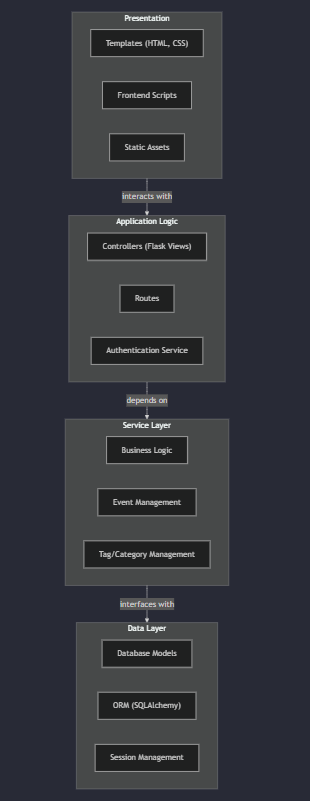

# D5 - Design

In this deliverable, you should describe the architectural design of your system. Structure your deliverable using the following sections. See the  [Team Project Instructions](https://canvas.nau.edu/courses/29116/pages/team-project-%7C-overview "Team Project | Overview")  for details about formatting. Check the lecture materials and perform additional research to produce a high-quality deliverable. As usual, if you have any questions, let me know.

## 1. Description

The EventPulse application utilizes a few key functionalities. There are account creation/login, user profiles, event posts, and user interests. There is a database for users and events. When users create an account, they are required to use a unique username and password. Once a user is logged into an account, they can access the rest of EventPulse's content. Users can edit their user profile, they can change their email and first name. The user database supports all of the user data. It holds a unique user id, email, username, password, first name, ineterests, and events. The list of interests that each user has can be updated at any time by completing the questionare. The questionare allows users to select which types of events they are interested in. Events are an essential feature of the EventPulse application. The Event database stores data about the event posts, such as location, title, address, etc. When a user creates an event, they are assigned to that event as a creator. Events and users are searchable by their title and first name or email. 

## 2. Architecture

The Event Pulse architecture is built in four layers to keep everything organized. The Presentation Layer is the front end that users interact with; it displays information and handles input through HTML, CSS, and JavaScript. The Application Logic layer manages user actions, such as logging in and navigating the app, making sure each request goes to the right place. The Service Layer contains the core functions, like creating and managing events, applying the app’s main rules and logic. Lastly, the Data Layer stores and retrieves all information in the database, ensuring data is safe and accessible. Each layer only interacts with the one below it, which keeps the system clean and easy to manage.
## 3. Class diagram

Present a refined class diagram of your system, including implementation details such as visibilities, attributes to represent associations, attribute types, return types, parameters, etc. The class diagram should match the code you have produced so far but not be limited to it (e.g., it can contain classes not implemented yet).

The difference between this class diagram and the one you presented in D.3 is that the latter focuses on the domain's conceptual model, while the former reflects the implementation. Therefore, the implementation details are relevant in this case.

_Grading criteria_ (6 points): Adequate use of UML; Adequate choice of classes and relationships; Completeness of the diagram; Adequate presentation of implementation details.

## 4. Sequence diagram

**Use Case**: Post an Event  
**Actor**: User  
**Trigger**: Goes to the 'add event' page  
**Pre-Conditions**: Must be logged in to post an event.  
**Post-Conditions**: The event feed has a new event post.  

**Scenario**: The user posts an event to the home page.  

- User successfully logs into their account.
- User navigates to the add event page.
- System validates user is logged in.
- The system renders the new event page.
- User posts event.
- The system adds the event to the database.
- The system flashes a success message to the user.
- The post is visible.

**Alternative Scenario**: An unregistered user tries to create a post  
- A user tries to navigate to the add event page.
- The system validates if the user is logged in.
- The system flashes an error message to the user.
- The user signs up for an account and logs in.
- The user navigates to the add event page.
- The system validates that the user is logged in.
- The system renders the new event page.
- User posts event.
- The system adds the event to the database.
- The system flashes a success message to the user.
- The post is visible.

## 5. Design Patterns

Split this section into two subsections. For each subsection, present a UML class diagram showing the application of a design pattern to your system (a different pattern for each section). Each class diagram should contain only the classes involved in the specific pattern (you don’t need to represent the whole system). Choose patterns from two different categories: Behavioral, Structural, and Creational. You are not limited to design patterns studied in class.

Tip: Your system may not be appropriate for any design pattern. In this case, for didactic purposes, be creative and extend the scope of your system slightly to make the design patterns appropriate.

Implement each design pattern in your system and provide GitHub links to the corresponding classes. For example (the links are illustrative, aka fake!):

Car: [https://github.com/user/repo/blob/master/src/com/proj/main/Car.java](https://github.com/user/repo/blob/master/src/com/proj/main/Car.java)

IBreakBehavior: [https://github.com/user/repo/blob/master/src/com/proj/main/IBreakBehavior.java](https://github.com/user/repo/blob/master/src/com/proj/main/IBreakBehavior.java)

BrakeWithABS: [https://github.com/user/repo/blob/master/src/com/proj/main/BrakeWithABS.java](https://github.com/user/repo/blob/master/src/com/proj/main/BrakeWithABS.java)

Brake: [https://github.com/user/repo/blob/master/src/com/proj/main/Brake.java](https://github.com/user/repo/blob/master/src/com/proj/main/Brake.java)

_Grading criteria_ (6 points, 3 for each pattern): Correct use of the design pattern as described in the literature; Adequate choice of the design pattern; Adequate implementation of the design pattern.

## 6. Design Principles

Starting on line 56, I believe we have a display of OCP working. While we have many options for the user to create an event with as much detail as possible, we don’t go as far as letting users control the entire form. With a template given, the user can do as much as possible without going overboard or past our original limits. I also believe that throughout our code, SRP is displayed. Our functions do one thing at a time, with simplicity for each action in mind at all times. For instance, the “edit profile” seen starting at line 123 has one responsibility; to change the inserted data in your profile. It doesn’t try to do too much and keeps “KISS” in mind. 